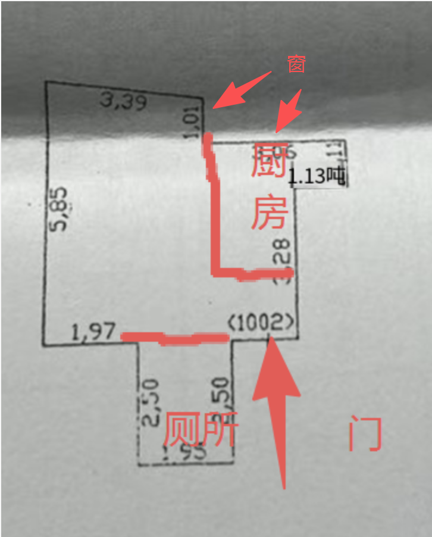

# 装修规划

## 一、房屋基本情况

> 两套房在附近小区，方便互相照应

### 🏠 房屋 A — 父母房

| 项目     | 详情                                                                                                          |
| -------- | ------------------------------------------------------------------------------------------------------------- |
| 位置     | **北京西城区 欧园小区**                                                                                 |
| 户型     | 一室无厅                                                                                                      |
| 面积     | 约 33 平方米                                                                                                  |
| 厨房     | 有                                                                                                            |
| 卫生间   | 有                                                                                                            |
| 格局     | 方正                                                                                                          |
| 居住人   | 两边父母轮换来住（每次两人）                                                                                  |
| 隔断方案 | 推拉门隔断                                                                                                    |
| 收纳方案 | ⭐⭐⭐**收纳是A房第一优先级**——除了住人，最重要的就是多柜子、多收纳，能做柜子的地方全部做满，尽可能多 |
| 装修方式 | **半包或全包**（半包：辅材+人工交给装修方，主材自己买；全包：全部交给装修方）                           |
| 定位     | 简洁实用，做饭+睡觉                                                                                           |
| 🐟 鱼缸  | 给孩子养鱼，需预留鱼缸位置+电源                                                                               |

> 💡 父母在外地有自己的房子，过来主要是帮忙照顾孩子、做饭。
> 💡 孩子来A房时可以看鱼、喂鱼，培养兴趣和责任感。

### 🏠 房屋 B — 自住房

| 项目     | 详情                                       |
| -------- | ------------------------------------------ |
| 户型     | 两室一厅                                   |
| 面积     | 约 90+ 平方米                              |
| 居住人   | 自己 + 媳妇 + 孩子                         |
| 位置关系 | 附近小区                                   |
| 核心诉求 | 给孩子足够的活动空间                       |
| 装修计划 | ⚠️**暂不装修**，只简单添置家具即可 |

**房间分配：**

| 房间 | 用途       | 说明                     |
| ---- | ---------- | ------------------------ |
| 主卧 | 夫妻主卧   |                          |
| 次卧 | 儿童房     | 已放高低床，可住两个孩子 |
| 客厅 | 孩子活动区 | 最大化活动空间           |

**孩子规划：**

- 🧒 老大：马上去儿童房（高低床）
- 👶 老二：预计 **2027 年** 出生，一直跟夫妻住在主卧，大了之后搬去儿童房与老大同住高低床
- 高低床正好满足将来两个孩子同住的需求

---

## 二、装修风格（待定）

> 待确认装修风格偏好，例如：现代简约、日式、北欧、工业风等

---

## 三、房屋 A（父母房）功能区域规划

### 整体思路

33㎡一室无厅，两边父母轮换来住，需求简单：**做饭 + 睡觉**。通过 **推拉门隔断** 将空间分为卧室区和起居区。

> ⭐⭐⭐ **收纳是A房第一优先级：除了住人，最重要的就是多柜子、多收纳，能做柜子的地方全部做满，一寸空间都不浪费。**

### 户型图（实际测量）

> 📐 **图纸比例 1:200**（图上 1cm = 实际 2m）

#### 🎬 房间实拍视频

<video src="room-video.mp4" controls width="600" preload="metadata">
  您的浏览器不支持视频播放，请 <a href="room-video.mp4">点击下载</a> 观看。
</video>

### 各区域说明

- **卧室区**：推拉门关闭后形成独立私密空间，放置双人床 + 衣柜
- **起居区**：推拉门打开时与卧室连通，空间通透；放沙发、餐桌、🐟 **鱼缸**
- **厨房**：父母做饭用，实用为主
- **卫生间**：洗漱

### 🐟 鱼缸规划（给孩子养鱼）

> 孩子来爷爷奶奶/姥姥姥爷家时可以看鱼、喂鱼，培养观察力和责任感

| 考虑项             | 建议                                                                                                                                   |
| ------------------ | -------------------------------------------------------------------------------------------------------------------------------------- |
| **位置**     | 起居区靠墙放置（电视柜旁/沙发对面/餐桌旁均可），避免阳光直射                                                                           |
| **尺寸**     | 33㎡空间有限，建议**小型成品鱼缸**（40-60cm长），放在柜子上或专用鱼缸架上                                                        |
| **鱼种**     | 建议养好养的观赏鱼：金鱼/孔雀鱼/灯科鱼，孩子容易观察且不易死                                                                           |
| **电源**     | ⭐**水电改造时预留专用插座**（鱼缸需要过滤器+氧气泵+灯，至少2-3个插孔）                                                          |
| **承重**     | 60cm鱼缸装满水约50-70kg，确认放置位置的承重（柜子/架子要结实）                                                                         |
| **安全**     | ⚠️ 鱼缸位置要考虑孩子安全——不要放太高（孩子够不到看不见）也不要放太低（防止孩子推倒），建议**离地60-80cm**，放在稳固的柜面上 |
| **日常维护** | 父母帮忙日常喂食换水，每周换水1/3即可，过滤器保持开启                                                                                  |
| **防水**     | 鱼缸下方柜面建议铺防水垫，避免换水溅湿家具                                                                                             |

> 💡 **装修时需提前做的事：**
>
> - 水电改造阶段：在鱼缸预定位置 **预留2-3个插座**（过滤泵+氧气泵+加热棒/灯）
> - 插座建议带 **独立开关**，方便控制鱼缸设备
> - 如果鱼缸靠近墙面，墙面建议 **局部做防水/防潮处理**

### ⭐ 收纳规划（重点）

> 原则：**能做柜子的地方全部做满，一寸空间都不浪费**——这是A房除了住人之外的第一优先级

| 位置      | 收纳方式               | 说明                                           |
| --------- | ---------------------- | ---------------------------------------------- |
| 卧室区    | 整面墙衣柜（顶天立地） | 到顶设计，上方放换季被褥，中间挂衣区，下方抽屉 |
| 床头/床尾 | 床头柜 + 床尾收纳      | 有空间的话床尾可做矮柜或斗柜                   |
| 起居区    | 电视墙/沙发背后储物柜  | 整面墙柜或半高柜，兼具展示和收纳               |
| 起居区    | 卡座式餐桌（座下收纳） | 餐桌靠墙做卡座，座位下方可收纳                 |
| 厨房      | 吊柜 + 地柜最大化      | 橱柜做到顶，充分利用厨房墙面                   |
| 入户区    | 鞋柜/玄关柜            | 入户门旁做顶天立地鞋柜                         |
| 卫生间    | 镜柜 + 马桶上方壁柜    | 利用卫生间墙面空间                             |

> 💡 33㎡空间小，柜子建议统一用 **浅色/白色**，视觉上不压抑，显大。

### 🛋️ 全屋定制注意事项

> 现在全屋定制已替代传统木工现场制作，价格更透明，工艺更稳定

| 项目               | 说明                                                                                    |
| ------------------ | --------------------------------------------------------------------------------------- |
| **计价方式** | 主流按**投影面积**计价（即柜子正面看到的面积：宽×高）                            |
| **价格参考** | 中低端约 600元/㎡投影面积，中高端（欧派/索菲亚等）约 800-1500元/㎡                      |
| **板材环保** | ⚠️ 600元/㎡档位要**特别注意板材环保等级**，父母住建议至少 **E0级或ENF级** |
| **下单时机** | 生产周期15-30天，建议**水电改造阶段就去量尺下单**，避免耽误工期                   |
| **避坑**     | 警惕"投影面积不限"的话术——通常限制柜体深度和层板数量，超出另收费                      |

### 💡 灯光方案建议

> 33㎡小户型，推荐 **主灯 + 局部辅助灯** 的组合，兼顾明亮和氛围

| 区域   | 建议                           | 说明                                           |
| ------ | ------------------------------ | ---------------------------------------------- |
| 卧室区 | 吸顶主灯 + 床头壁灯            | 主灯负责整体照明，壁灯方便夜间起夜（父母友好） |
| 起居区 | 吸顶主灯 + 餐桌上方小吊灯      | 小空间用主灯最省事、最明亮                     |
| 厨房   | 集成吊顶LED平板灯 + 橱柜下灯带 | 灯带照亮操作台面，做饭不背光                   |
| 卫生间 | 集成吊顶LED灯 + 镜前灯         | 镜前灯洗漱时看得清                             |

> ⚠️ **不建议做无主灯设计**：无主灯需要吊顶+大量改电位+买很多射灯/筒灯，成本高、33㎡空间也不需要复杂灯光层次。主灯方案简单、明亮、省钱。

### 推拉门隔断方案

| 考虑项     | 说明                                                   |
| ---------- | ------------------------------------------------------ |
| 材质选择   | 玻璃推拉门（透光不透明）/ 木质推拉门 / 铝合金框架+玻璃 |
| 轨道方式   | 吊轨（地面无轨道，老人不易绊倒，推荐）/ 地轨           |
| 隔音效果   | 双层玻璃 > 单层玻璃 > 布帘                             |
| 门扇数量   | 2扇或3扇，根据开口宽度确定                             |
| 适老化考虑 | 吊轨无地面障碍、把手易握、滑动顺畅轻便                 |

### 装修方式：半包 或 全包

> 33㎡小户型，两种方式都可以，根据自身精力和预算选择。

**两种方式对比：**

| 对比项 | 半包 | 全包 |
| ------ | ---- | ---- |
| 含义 | 辅材+人工交给装修方，主材自己买 | 全部材料+人工都交给装修方 |
| 优点 | 主材质量自己把控，性价比高 | 省心省力，一站式搞定 |
| 缺点 | 需要自己跑建材市场选主材 | 主材品质不好把控，容易被用料缩水 |
| 适合 | 有时间精力、想把控质量 | 工作忙、精力有限、想省事 |

**半包分工：**

| 谁负责 | 内容                                                        |
| ------ | ----------------------------------------------------------- |
| 装修方 | 辅材（水泥、沙子、电线、水管、防水等）+ 人工施工            |
| 自己买 | 瓷砖/地板、柜子（定制）、推拉门、厨卫洁具、灯具、开关面板等 |

**全包分工：**

| 谁负责 | 内容                                                        |
| ------ | ----------------------------------------------------------- |
| 装修方 | 全部辅材 + 主材 + 人工施工                                  |
| 自己买 | 家具、家电、软装等（一般不含在全包内）                      |

**操作建议：**

| 步骤                 | 说明                                             |
| -------------------- | ------------------------------------------------ |
| 找 2-3 家对比        | 同时问半包和全包报价，横向对比                   |
| 材料品牌写进合同     | 无论半包全包，电线、水管、防水等品牌型号必须明确 |
| 全包要看主材清单     | 确认每项主材的品牌、型号、数量，防止偷换         |
| 柜子单独找定制商家   | 专门的全屋定制比装修公司做的质量好、性价比高     |
| 推拉门单独找门窗商家 | 专业定制，价格透明                               |

### 🔧 施工工序流程（按顺序）

| 序号 | 工序                        | 主要内容                                                                             | 谁负责（半包）             | 预估工期                                 |
| ---- | --------------------------- | ------------------------------------------------------------------------------------ | -------------------------- | ---------------------------------------- |
| 1    | **量房设计**          | 现场量尺寸、确认承重墙/管道位置、出设计方案                                          | 装修方出方案，业主确认     | 1-3天                                    |
| 2    | **办开工手续**        | 物业报备、缴纳装修押金、办施工许可                                                   | 业主办                     | 1天                                      |
| 3    | ⭐**旧房拆除**        | 拆旧地砖/墙砖、铲墙皮、拆旧吊顶、拆旧门窗、拆旧橱柜/洁具、清运建筑垃圾               | 装修方（或专业拆除队）     | **2-5天**                          |
| 4    | **主体改造**          | 砌新墙、改门洞位置、封旧门洞、结构加固（如有）；新旧墙交接处**局部挂网**防开裂 | 装修方                     | 2-3天                                    |
| 5    | **水电改造**          | 开槽、布水管电线、预留插座/开关/灯位、🐟**鱼缸位置预留2-3个带开关插座**        | 装修方施工，业主确认点位   | 3-5天                                    |
| 6    | ⭐**水电验收**        | 打压试水、电路通断测试、拍照留档                                                     | 业主必须到场验收签字       | 1天                                      |
| 7    | **防水施工**          | 卫生间/厨房/阳台刷防水涂料（至少2遍）                                                | 装修方                     | 1-2天                                    |
| 8    | ⭐**闭水试验**        | 卫生间蓄水48小时检查是否漏水，楼下确认                                               | 业主必须到场确认           | 2天                                      |
| 9    | **瓦工/贴砖**         | 铺贴墙砖地砖、做地面找平、门槛石/窗台石安装                                          | 装修方施工（瓷砖业主买）   | 5-7天                                    |
| 10   | **木工**              | 吊顶、石膏线、现场柜体骨架（如有）、隔断基层                                         | 装修方                     | 3-5天                                    |
| 11   | **油工/墙面处理**     | 墙面刮腻子（2-3遍）、打磨、刷底漆+面漆                                               | 装修方施工（乳胶漆可自购） | 7-10天                                   |
| 12   | **定制柜安装**        | 全屋定制衣柜、橱柜复尺→工厂生产→上门安装                                           | 业主自购，商家安装         | 1-2天（安装），生产周期15-30天需提前下单 |
| 13   | **推拉门安装**        | 推拉门测量→生产→安装，吊轨/地轨安装调试                                            | 业主自购，商家安装         | 1天（安装），需提前15-20天下单           |
| 14   | **厨卫吊顶**          | 铝扣板/蜂窝大板吊顶安装、浴霸/排风扇预留                                             | 业主自购，商家安装         | 1天                                      |
| 15   | **地板铺设**（如有）  | 木地板铺设（卧室区域）、踢脚线安装                                                   | 业主自购，商家安装         | 1-2天                                    |
| 16   | **门安装**            | 室内门、卫生间门安装                                                                 | 业主自购，商家安装         | 1天                                      |
| 17   | **洁具安装**          | 马桶、花洒、水龙头、浴室柜安装                                                       | 业主自购，水电工安装       | 1天                                      |
| 18   | **灯具/开关面板安装** | 所有灯具、开关插座面板安装                                                           | 业主自购，电工安装         | 1天                                      |
| 19   | **厨卫设备安装**      | 油烟机、灶具、水槽、热水器安装                                                       | 业主自购，商家安装         | 1天                                      |
| 20   | **收尾保洁**          | 全屋开荒保洁，清理建筑垃圾                                                           | 可请专业保洁               | 1天                                      |
| 21   | **软装进场**          | 窗帘、沙发、餐桌、床、家电、🐟**鱼缸+鱼缸架**等入场                            | 业主自购                   | 1-3天                                    |
| 22   | ⭐**通风散味**        | 开窗通风除甲醛，建议至少通风3个月以上                                                | 业主                       | ≥3个月                                  |

### ⏸️ 各工序停工养护时间（重要！）

> ⚠️ **必须严格遵守停工时间，擅自缩短会导致开裂、空鼓等质量问题**

| 工序           | 完工后停工时间   | 原因                                                 |
| -------------- | ---------------- | ---------------------------------------------------- |
| 砌墙工程       | **≥ 5天** | 水泥砂浆需充分凝固，否则后续施工震动可能导致墙体开裂 |
| 水电改造       | **≥ 2天** | 开槽填槽后的水泥砂浆需要初凝                         |
| 防水工程       | **≥ 3天** | 防水涂料需完全固化，之后再做48小时闭水试验           |
| 瓷砖铺贴       | **≥ 5天** | 瓷砖胶/水泥砂浆需充分凝固，过早踩踏会导致空鼓、脱落  |
| 美缝施工       | **≥ 2天** | 美缝剂需固化，未干透踩踏会变形、脱落                 |
| 腻子（墙面）   | **≥ 3天** | 腻子需充分干透，否则后续刷漆会起皮、开裂             |
| 乳胶漆（墙面） | **≥ 7天** | 乳胶漆需完全干透和养护，潮湿/冬季可能需更长时间      |

> 💡 **不同工序停工时长差异取决于材料特性**——防水涂料需3天固化，乳胶漆需7天养护，砌墙和贴砖需5天让水泥充分凝固。
>
> 💡 **签合同时可把停工养护时间写进工期表**，防止施工方为赶工偷偷缩短养护期。

> ⚠️ **旧房改造特别注意：**
>
> - 第3步拆除是旧房改造的**重头戏**，33㎡虽然面积小，但拆地砖、铲墙皮、拆旧厨卫等工作量不小
> - 拆除前务必确认**承重墙位置**（物业/原始图纸），承重墙绝对不能动
> - 旧房水电管线老化，建议**全部换新**，不要在旧管线上接线
> - 拆除产生的建筑垃圾较多，提前和物业确认**垃圾清运方式和费用**
> - 拆除费用一般按面积或项目算，33㎡旧房拆除费大约 **3000-6000元**（视拆除程度）

> 💡 **其他提示：**
>
> - 第12-13步定制类产品（柜子、推拉门）**生产周期长**，建议在水电改造阶段就去下单，避免耽误工期
> - 第11步墙面漆需要充分晾干，每遍之间间隔至少24小时
> - 第22步通风非常重要，尤其父母要住，甲醛标准要严格把控
> - 整体预估工期：**硬装约 50-70 天**（含拆除，不含定制品生产周期和通风期）
